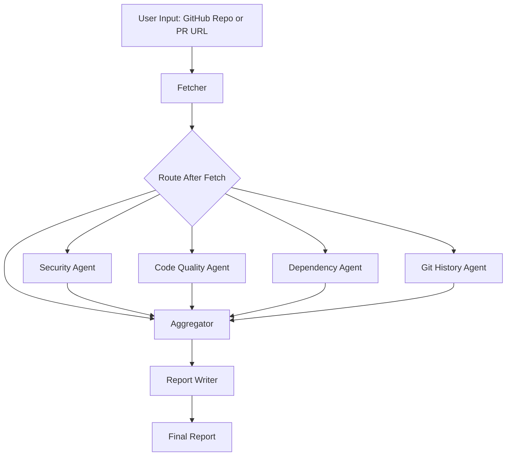

# DevPulse: AI Code Review and Technical Debt Analyst


## 🚀 Short Description
DevPulse is a LangGraph-based multi-agent AI system that reviews any GitHub repository or PR and generates a technical health report.

It combines code quality, security, dependency risk, and git activity analysis into one clear score with actionable recommendations.

## 🎯 What Problem It Solves
Developers and teams often use multiple tools to understand project health. That takes time and still misses the full picture.

DevPulse solves this by giving a single, structured audit report with:

- Overall health score
- Priority findings with evidence
- Recommended next actions
- Follow-up Q&A for deeper understanding

## 🖼️ Demo
Add your screenshot or GIF here:


If you do not have media yet, keep this placeholder and replace it later.

## 🧠 Architecture Overview
DevPulse runs as a conditional LangGraph workflow:

1. Fetcher collects repository/PR metadata, file index, sampled file contents, dependency files, and commit samples.
2. Router decides which specialist agents should run based on repository context.
3. Specialists run in parallel where possible.
4. Aggregator merges all results and computes final scoring.
5. Report Writer generates a professional Markdown report.
6. Follow-up agent answers user questions using generated context.

### Flow (Text)

		Input URL (Repo or PR)
			-> Fetcher
			-> Conditional Router
					-> Security Agent
					-> Code Quality Agent (if Python files found)
					-> Dependency Agent (if manifest files found)
					-> Git History Agent (repo mode only)
			-> Aggregator
			-> Report Writer
			-> End

## 🕸️ Mermaid Graph Diagram


## ✨ Features
- Multi-agent LangGraph orchestration with conditional routing
- Parallel specialist analysis for faster audits
- Unified score with category breakdown and issue severity
- Security checks and dependency vulnerability analysis (OSV)
- Code complexity analysis for Python projects
- Git activity and commit hygiene insights
- Downloadable Markdown and JSON reports
- Follow-up Q&A chat on top of scan results
- Runtime profile and scan coverage visibility

## 🧰 Tech Stack
- Agent Framework: LangGraph, LangChain
- LLMs: Groq (Llama 3.3 70B), Gemini 1.5 Flash (fallback)
- APIs/Tools: GitHub REST API, OSV API, Radon
- Frontend: Streamlit
- Language: Python 3.11+
- Testing: Pytest + smoke tests
- CI: GitHub Actions

## 📁 Project Structure
```text
devpluse/
├─ agents/
│  ├─ fetcher_agent.py
│  ├─ security_agent.py
│  ├─ code_quality_agent.py
│  ├─ dependency_agent.py
│  ├─ git_history_agent.py
│  ├─ aggregator_node.py
│  └─ report_writer_agent.py
├─ graph/
│  └─ devpulse_graph.py
├─ state/
│  └─ state.py
├─ tools/
│  ├─ llm_router.py
│  ├─ github_tools.py
│  ├─ osv_tools.py
│  ├─ report_builder.py
│  ├─ history_store.py
│  └─ runtime_config.py
├─ ui/
│  └─ app.py
├─ tests/
├─ .github/workflows/ci.yml
├─ requirements.txt
├─ smoke_test.py
└─ README.md
```

## ✅ Prerequisites
- Python 3.11 or higher
- Git installed
- Internet access for GitHub and OSV APIs
- API keys (at least one LLM key):
	- GROQ_API_KEY or GEMINI_API_KEY
	- GITHUB_TOKEN (recommended to avoid rate limits)

## ⚙️ Installation
```bash
git clone <your-repo-url>
cd devpluse
python -m venv .venv
```

### Windows
```powershell
.\.venv\Scripts\Activate.ps1
pip install -r requirements.txt
copy .env.example .env
```

### Linux or macOS
```bash
source .venv/bin/activate
pip install -r requirements.txt
cp .env.example .env
```

Then open .env and add your API keys.

## 🔐 Environment Variables
| Key | Description | Required |
|---|---|---|
| GROQ_API_KEY | Primary LLM provider key used by router | Optional (recommended if Gemini not set) |
| GEMINI_API_KEY | Fallback LLM provider key | Optional (recommended if Groq not set) |
| GITHUB_TOKEN | GitHub API token for higher rate limits | Optional (strongly recommended) |
| LANGCHAIN_TRACING_V2 | Enable LangSmith tracing when set to true | Optional |
| LANGCHAIN_API_KEY | LangSmith API key for trace upload | Optional |
| LANGCHAIN_PROJECT | LangSmith project name | Optional |

## ▶️ Usage
Run the Streamlit app locally:

```powershell
streamlit run ui/app.py
```

App URL:

```text
http://localhost:8501
```

### Sample Workflow
1. Paste repository URL, for example: https://github.com/pallets/flask
2. Set scan depth.
3. Click Run Health Check.
4. Review score, findings, and recommendations.
5. Download report as Markdown or JSON.

### Sample Output (Short)
```text
Overall Health Score: 78/100
Risk Level: Medium
Top Findings:
1) High cyclomatic complexity in selected Python modules
2) Outdated dependencies with known CVEs
3) Inconsistent commit message quality
```

## 🧩 Graph Nodes Explanation
| Node Name | Role | Description |
|---|---|---|
| fetcher | Data collection | Parses repo/PR URL, fetches metadata, file index, sampled file contents, dependency files, commit samples |
| security | Security analysis | Runs security-focused checks and returns security findings |
| code_quality | Code analysis | Uses complexity heuristics and code signals to detect maintainability risks |
| dependency | Dependency analysis | Parses manifest files and queries OSV for vulnerable packages |
| git_history | Team/process analysis | Evaluates commit activity and commit message quality trends |
| aggregator | Result synthesis | Validates/merges specialist outputs and computes score breakdown |
| report_writer | Report generation | Builds final professional Markdown report with recommendations |
| followup | Q&A | Answers user follow-up questions using report context |

## 📈 LangSmith Tracing
DevPulse can be traced with LangSmith for debugging and observability.

Add these keys to .env:

```env
LANGCHAIN_TRACING_V2=true
LANGCHAIN_API_KEY=your_langsmith_key
LANGCHAIN_PROJECT=DevPulse
```

Then run the app normally. Open your LangSmith dashboard to view traces.

## 🤝 Contributing
1. Fork the repository.
2. Create a feature branch.
3. Make your changes with clear commit messages.
4. Run tests before opening PR.
5. Submit pull request with summary and screenshots if UI changed.

Run checks:

```powershell
pytest
python smoke_ci.py
python smoke_test.py
```

## 📜 License
This project is licensed under the MIT License.

## 👨‍💻 Author
- Name: Sumit Kumar
- GitHub: https://github.com/DevPlus
- LinkedIn: https://www.linkedin.com/in/sumit-kumar-45b39b29b/

## 🧪 .env.example (Sample)
```env
# Required for better GitHub API limits
GITHUB_TOKEN=

# At least one LLM key recommended
GROQ_API_KEY=
GEMINI_API_KEY=

# Optional LangSmith tracing
LANGCHAIN_TRACING_V2=false
LANGCHAIN_API_KEY=
LANGCHAIN_PROJECT=DevPulse
```

