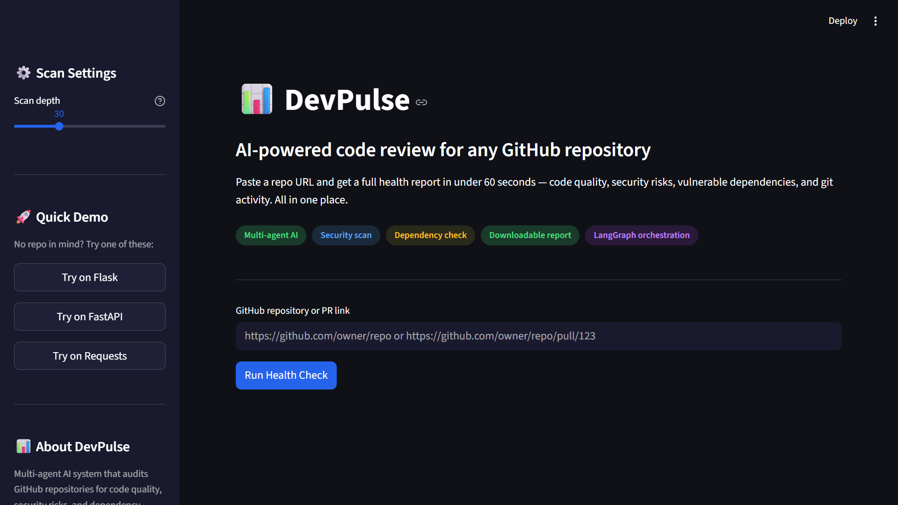
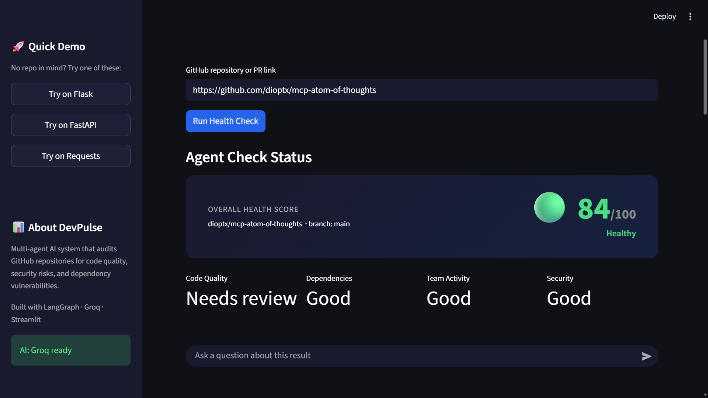
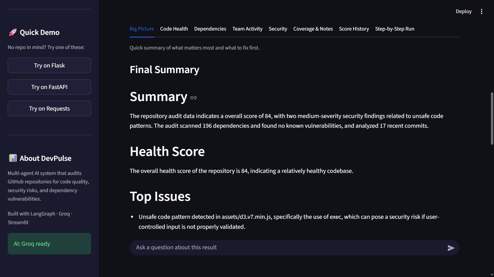
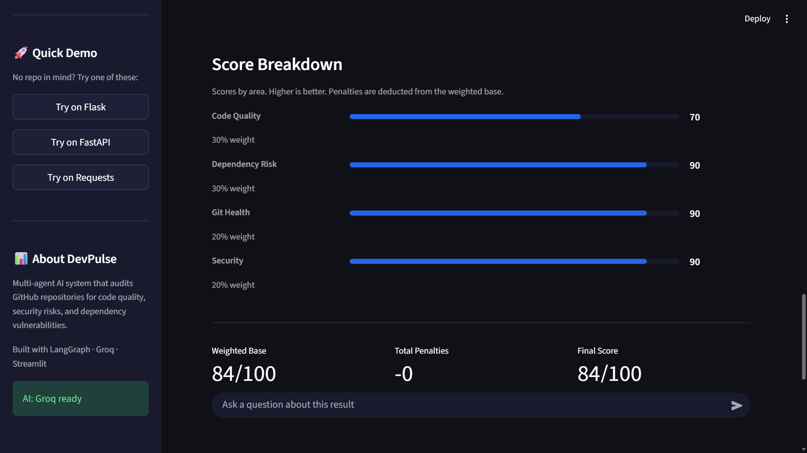

# DevPulse - Multi-Agent Code Review System (Option B)


Demo Video Link->https://drive.google.com/file/d/1ntCUHW_la5jA_l4QI6pHRMZP_xJU1t7D/view?usp=sharing
## Overview
DevPulse analyzes a GitHub repository or pull request and produces a structured technical health report.
It combines code quality, dependency risk, security pattern checks, and git activity signals.
The output includes scores, findings, routing rationale, and downloadable Markdown/JSON reports.

## Problem Statement
Code review decisions are often based on fragmented signals from different tools.
Reviewers need a quick way to understand whether a repository or PR is low risk or needs attention.
Manual consolidation is slow and inconsistent, especially under time constraints.
This project provides one consolidated report from a single workflow run.

## Problem to Solution Mapping
- Problem: Signals are split across tools, so reviewers do manual consolidation.
  What we built: One workflow that combines code quality, dependency, security, and git-health checks into one report.
- Problem: Review decisions are slow when data collection is manual.
  What we built: A fetcher + router + specialist-agent flow that automates collection and analysis.
- Problem: Teams need faster go/no-go insight for repos and PRs.
  What we built: A weighted score, prioritized findings, and recommendations in JSON/Markdown output.
- Problem: One-pass scans can miss context in partial coverage situations.
  What we built: A lightweight meta-controller loop that can refine scan depth based on observations.

## Approach
The system uses a LangGraph workflow with specialized agents for each analysis area.
A lightweight meta-controller wraps the graph and runs an iterative loop: Thought -> Action -> Observation -> optional refinement -> Final.
Refinement is heuristic-driven (based on coverage/warnings), not LLM planning.

## Architecture Overview
- Orchestration: LangGraph coordinates fetch, route, specialist agents, aggregation, and report writing.
- Modular agents:
  - `fetcher`: collects repo/PR context
  - `router`: enables/skips agents based on repository signals
  - `security`, `code_quality`, `dependency`, `git_history`: domain analyses
  - `aggregator`: validates and merges outputs, computes weighted score and penalties
  - `report_writer`: generates report text and follow-up responses
- Meta-controller:
  - Calls the graph as a tool
  - Logs `thought`, `action`, `observation` steps
  - Optionally reruns with higher scan depth when coverage is limited

## System Flow (Diagram)
```text
+----------------------------------+
| User Input (Repo or PR URL)      |
+----------------------------------+
    |
    v
+----------------------------------+
| Meta Controller                  |
| Thought -> Action -> Observation |
| Optional refinement              |
+----------------------------------+
    |
    v
+----------------------------------+
| DevPulse Graph (LangGraph)       |
|  +----------------------------+  |
|  | Fetcher                    |  |
|  | Router (conditional)       |  |
|  | Security Agent             |  |
|  | Code Quality Agent         |  |
|  | Dependency Agent           |  |
|  | Git History Agent          |  |
|  | Aggregator                 |  |
|  | Report Writer              |  |
|  +----------------------------+  |
+----------------------------------+
    |
    v
+----------------------------------+
| Final Output                     |
| UI View + JSON/Markdown export   |
+----------------------------------+
```

## Workflow
1. User submits a GitHub repository URL or PR URL.
2. Meta-controller starts a baseline graph run.
3. Router conditionally enables specialist agents.
4. Enabled agents execute analysis and produce structured results.
5. Aggregator validates outputs, applies scoring and penalties, and ranks findings.
6. Meta-controller observes coverage/warnings and may run one refinement pass.
7. Report writer produces the final report for UI display and export.

## Key Features
- Conditional multi-agent routing based on repository context.
- Integrated external tools: GitHub API and OSV vulnerability API.
- Static analysis support through Radon (Python complexity) and security pattern checks.
- Weighted scoring with explicit penalty breakdown.
- Structured output including findings, scores, routing rationale, and execution traces.
- Iterative controller trace with visible `thought`, `action`, and `observation` logs.
- Exportable Markdown and JSON reports.

## Example Output
```json
{
  "score_breakdown": {
    "code_quality": 72,
    "dependency": 80,
    "git_history": 68,
    "security": 75,
    "weighted_base": 74,
    "overall": 66
  },
  "top_findings": [
    {
      "title": "Vulnerability in requests",
      "severity": "high"
    }
  ],
  "meta_loop_trace": [
    {
      "step": 1,
      "thought": "Start baseline analysis",
      "action": {"tool": "devpulse_graph.invoke", "scan_depth": 30},
      "observation": {"source_coverage_ratio": 0.58, "warnings_count": 1}
    },
    {
      "step": 2,
      "thought": "Refine due to limited coverage",
      "action": {"tool": "devpulse_graph.invoke", "scan_depth": 45},
      "observation": {"source_coverage_ratio": 0.79, "warnings_count": 0}
    }
  ]
}
```

## Limitations
- The meta-controller is heuristic-driven; it is not a general autonomous planner.
- Code quality analysis currently focuses on Python complexity signals.
- Security analysis relies on pattern matching and can produce false positives/negatives.
- Large repositories may be partially scanned due to scan-depth and API budget constraints.
- External API availability/rate limits can affect completeness.

## What's Next
- Limitation to address first: The meta-controller currently decides refinement using fixed heuristics (coverage and warning thresholds).
- Improvement planned: Add a configurable refinement policy with per-repo profiles and measurable stop criteria, so refinement decisions are more reliable and auditable without claiming full autonomous planning.

## How to Run
```bash
git clone https://github.com/sumit1kr/DevPlus2.0
python -m venv .venv
```

Windows (PowerShell):
```powershell
.\.venv\Scripts\Activate.ps1
pip install -r requirements.txt
streamlit run ui/app.py
```

Linux/macOS:
```bash
source .venv/bin/activate
pip install -r requirements.txt
streamlit run ui/app.py
```

Optional environment variables:
- `GITHUB_TOKEN` (recommended for higher API limits)
- `GROQ_API_KEY` or `GEMINI_API_KEY` (for LLM-backed report writing/follow-up)

## Screenshots

**Fig 1**



**Fig 2**



**Fig 3**



**Fig 4**



